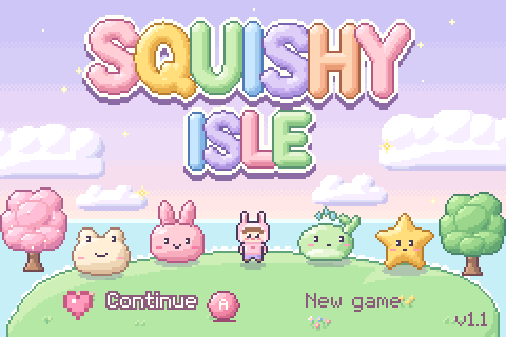
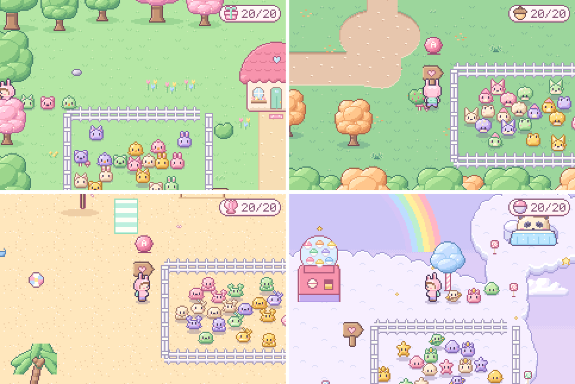
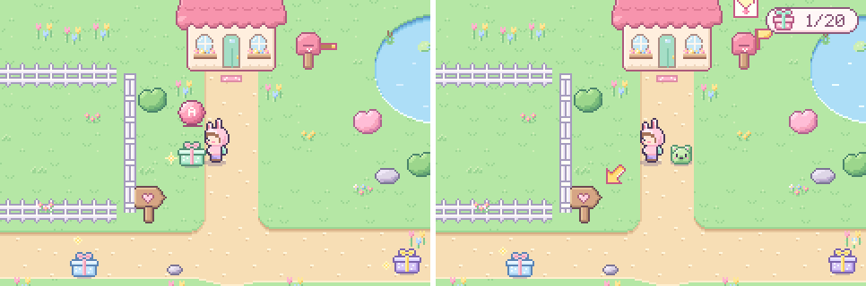
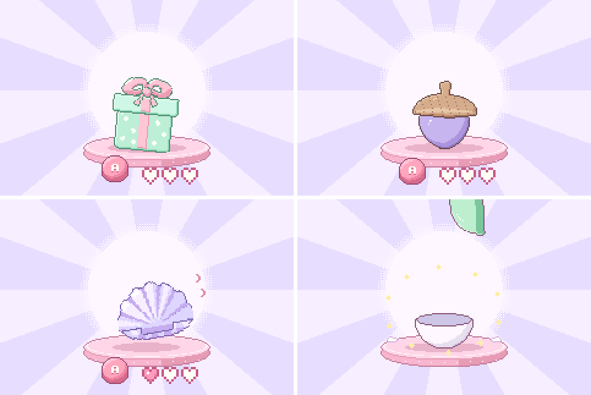
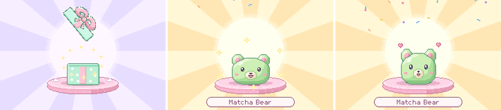
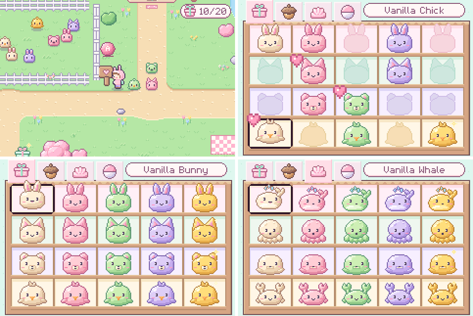
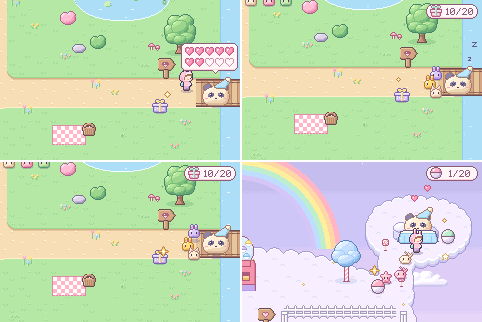
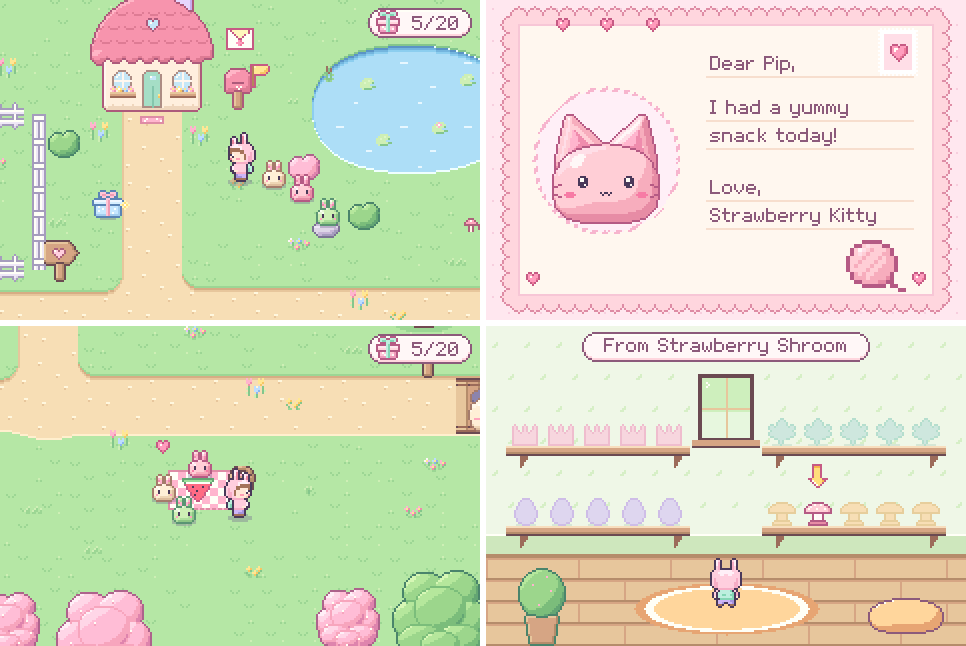
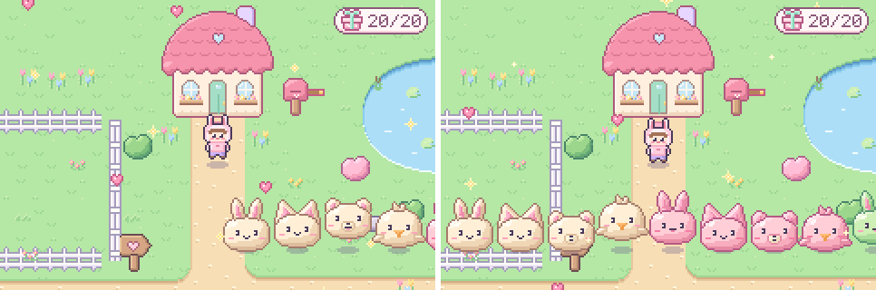
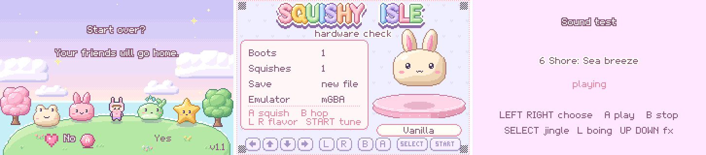

# Squishy Isle

A calm collecting game for toddlers (about 2 to 4 years old), made as a real
Game Boy Advance ROM. The child walks Pip, a small kid in a bunny hoodie,
around a pastel island, opens surprise containers, squishes the mochi
friends inside and fills the Squishy Shelf. There are no battles, no fail
states and no timers, and the child does not need to read.

Version 1.1. All screenshots on this page come from the ROM, running on
the mGBA emulator core, shown at 2x.



## Download and play

1. Download [release/squishy-isle.gba](release/squishy-isle.gba) (617 KB).
2. Open it in any GBA emulator. The game is built and tested on mGBA.
3. On a Trimui Brick, copy it into the GBA ROM folder by FTP. Keep the file
   name the same when you update: the save file follows the ROM's name.

[docs/BRICK.md](docs/BRICK.md) has the full install steps, the emulator
settings (integer 4x scale, no smoothing) and the Brick test checklist.

## Controls

| Button | On the map | Elsewhere |
| --- | --- | --- |
| D-pad | Walk | Move the cursor |
| A | Open a container, read the mailbox, snack time, pen sign | Squish, choose |
| B | Pip hops (the followers hop after him); also opens a container | Squish, go back |
| START | Open the Squishy Shelf | Go back |
| L / R | Nothing | Turn shelf pages |
| SELECT | Nothing (safe) | Nothing |

Every press gives a happy result. No button is wrong, and nothing in play
can lose a friend.

## The island

Four areas open one after the other. Each area has its own container,
four species of friends in five flavors (20 friends), its own song, a
friend pen and a house.



| Area | Container | Friends | Song |
| --- | --- | --- | --- |
| Blossom Meadow | Gift box | Bunny, Kitty, Bear, Chick | "Sleepy clover", F major waltz |
| Berry Woods | Acorn | Frog, Fox, Dino, Shroom | "Acorn trail", A minor to C major |
| Seashell Shore | Seashell | Whale, Octo, Seal, Crab | "Sea breeze", D major 6/8 |
| Cloud Hill | Capsule machine | Cloud, Star, Planet, Uni | "Floating up", E flat major |

The five flavors are Vanilla, Strawberry, Matcha, Taro and a rare,
shimmering Sparkle. That makes 80 friends in all. Every container holds a
friend the child does not have yet, so there are never duplicates. Each
new game shuffles the order, and Sparkles tend to come last.

## Explore

Up to three containers wait on the map at a time. They hop now and then
and a twinkle circles them. When Pip walks up to one, a bouncing A button
shows above it. After 5 seconds without a find, a soft blinking arrow next
to Pip points to the nearest container, so a young child always has a
direction. The counter pill at the top right shows the area's icon and how
many friends are found, and it hops when a new one comes home.



## Open and meet

The view moves to the open screen. The container sits big on a cushion.
Each press of A or B makes it jump higher with a rising chime, and the
three hearts fill. The third press pops it: the lid, acorn cap, top shell
or capsule dome flies off and sparkles burst out. If nobody presses, it
starts to open by itself after 4 seconds, so no child is ever stuck.



The new friend drops onto the cushion with a squeak, a ring of stars,
confetti and its name. Each press squishes it: a squash, a squeak and
hearts. After three squishes, or 5 calm seconds, it hops away to the map.



## Friends, the pen and the shelf

The first three friends found follow Pip in a line, and they come along
into every area. The rest waddle in their area's friend pen, so the island
fills with life as the collection grows. The heart sign by each pen opens
a picker for that area's friends: A on a friend adds it to the front of
the line (the oldest follower goes home when three follow) or removes it,
and big heart badges mark who follows.

START opens the Squishy Shelf: one page per area, 4 rows of species by 5
flavors. Friends not found yet show as soft silhouettes with "Find me!".
L and R turn the pages, and A shows a friend big for more squishes.



## Momo and the way on

Momo, a sleepy pastel panda in a nightcap, lies across the way to the next
area. When Pip comes close, Momo opens an eye and a bubble of 10 hearts
floats over it: one filled heart for each friend found in that area, so a
child who cannot count yet sees how many are still missing. The newest
heart hops. With the 10th friend, the
area's friends hop over and tickle Momo until it wakes up, hops for joy
and waddles off to sleep across the next way. At the end, Momo sleeps
tucked in on a cloud bed on Cloud Hill, and hops with hearts when Pip
visits.



## Mailbox, snack time and houses

After each new friend, the meadow mailbox flag waves and an envelope bobs
over it. Every new friend sends a letter, and the letters wait their
turn. A by the mailbox opens the oldest one waiting: a happy
message and the gift it sends. The picnic basket gives snack time: a treat
pops out, the followers hop over, take a bite each with a squeak, then go
back in line. Each area's house has a room with wall shelves for that
area's 20 gifts. Gifts not received yet are silhouettes.



## Parade

The first time an area has all 20 friends, they march across the screen
in flavor bands, hopping, while hearts and twinkles drift down. Pip hops
along. It plays once per area and takes about 7 seconds.



## For grown-ups

- **New game** is only on the title screen. With friends on the save, it
  asks "Start over?" with No first, and Yes needs A held for 3 seconds
  while six hearts fill. A button-mashing toddler cannot erase the
  collection.
- **Saves** are automatic: after each new friend, after a letter, after a
  follower change, at each door and area change, and when Pip stands
  still for 1 second. The save has two copies with a CRC-32 check, so a
  power cut during a write keeps the copy before it. Continue puts Pip
  back where he last stood.
- **Hardware check**: hold L + R + SELECT while the game starts. It shows
  the buttons, a sound, the save and the boot count.
- **Sound test**: hold L + R + START while the game starts. It plays all
  8 songs, a jingle and the effects.



## Music and sound

The sound uses the GBA's four tone channels. The lead plays on the wave
channel and the bass on a square channel. There are 8 songs: title, one per
area, the shelf music box, the open tune and the new friend jingle. Every
song loops without a seam and keeps time after a slow frame. Chimes and
squeaks use the second square channel and clicks use the noise channel,
over the music; the boing borrows the bass channel for a moment. The
tests check every note's pitch, the tempo, the loops, the loudness and
that there are no clicks.

## Status

The game is complete (step 7, v1.1). What remains is the owner's test on
the Trimui Brick with the [docs/BRICK.md](docs/BRICK.md) checklist.

| Step | What it did |
| --- | --- |
| Mockups | 8 screens and 80 squishies, scored against toddler readability |
| 1 | Toolchain, cartridge header, headless test harness, hardware check |
| 2 | Art in the ROM: the meadow, the shelf, the close-up |
| 3 and 4 | The game loop: boxes, open, reveal, followers, pen, title, saves |
| 5 | Music engine and 8 songs, sound effects mix |
| 6 | Woods, Shore, Cloud Hill, Momo, mailbox, snack time, houses and gifts |
| 7 | QA: toddler stress test, frame and stack audit, B hop, parade, v1.0 |
| 7.6 | Code review fixes before the Brick test: the note after a jingle, the Continue spot, the counter hop, Momo's helpers; v1.1 |

Full notes per step: [docs/HANDOFF.md](docs/HANDOFF.md). Design:
[docs/DESIGN.md](docs/DESIGN.md).

## How it is tested

`make -C rom test` runs 21 suites (449 checks, about 2 minutes) on the real
mGBA core, headless. A script presses buttons, and the checks read the
game's debug log, the screenshots, memory dumps and recorded audio:

- **Play:** every scene, every area, the full 80-friend game from a new
  save to Momo's bed, Continue after a reboot, and the save after a power
  cut at every byte of a write.
- **Toddler stress test:** a mash driver presses random taps, chords, held
  directions and long idle spells on 5 saves. Soak runs of millions of
  frames found and fixed stuck and lost-press bugs.
- **Audio:** the pitch of every note, the tempo and the loops, clicks,
  levels, and the song after a jingle.
- **Limits:** the frame work per scene (the worst is about 115 of
  228 scanlines), the stack depth, and every printed string against its space.

## Build the ROM

Needs Ubuntu 24.04 packages and Python 3 with numpy and Pillow:

```
sudo apt-get update
sudo apt-get install -y --no-install-recommends gcc-arm-none-eabi libnewlib-arm-none-eabi libmgba-dev
pip install numpy pillow
make -C rom
make -C rom test
```

The ROM is `rom/build/squishy_isle.gba`. The build uses Ubuntu's ARM
compiler with its own startup code, linker script and header tool, with
no devkitPro.

## Repository layout

- `rom/src/` the game in C: one file per scene (`title.c`, `viewer.c` for
  the maps, `open.c`, `closeup.c`, `shelf.c`, `letter.c`, `house.c`,
  `jukebox.c`, `hwcheck.c`), plus sound, save, text and the scene manager.
- `tools/` the Python art and music pipeline. All art is procedural or
  hand-placed pixel data in 15-bit color, checked against the GBA limits
  (layers, palettes, colors per tile and per sprite). `music.py` holds the
  songs as note text.
- `test/` the headless harness (`harness.c`), the play scripts and the
  checks.
- `docs/` design, handoff notes, the Brick guide and step screenshots.
- `release/` the current ROM.
- `mockups/` the first design mockups.

## Design history

The first mockups came from the same art pipeline, before the ROM
existed. Rebuild them with `python3 tools/export_mockups.py`.


All 80 squishies: [mockups/squishy_sheet.png](mockups/squishy_sheet.png).
