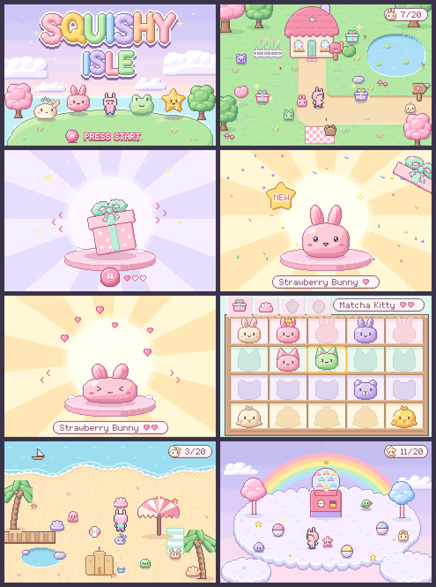
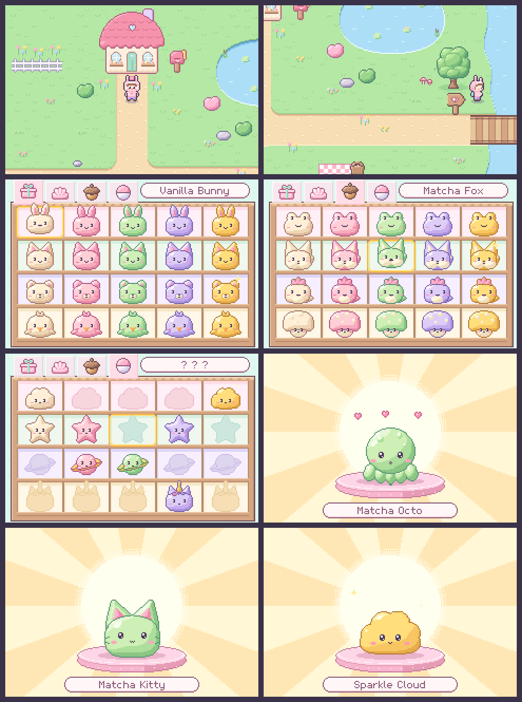

# Squishy Isle

A calm collecting game for toddlers, made for Game Boy Advance and played on
an emulator (Trimui Brick). Walk around a pastel island, open surprise
containers, squish the mochi friends inside and fill your shelf.
No battles, no fail states, no reading needed.



- Game design: [docs/DESIGN.md](docs/DESIGN.md)
- Handoff for the next session: [docs/HANDOFF.md](docs/HANDOFF.md)
- Mockups (4x, 960x640): [mockups/](mockups/)
- All 80 squishies: [mockups/squishy_sheet.png](mockups/squishy_sheet.png)

## Status

- Phase 1, mockups: done.
- ROM step 1, toolchain and hardware check: done, tested on the Trimui
  Brick (boot, buttons, sound, save).
- ROM step 2, art in the ROM: done. [release/squishy-isle.gba](release/squishy-isle.gba)
  - Walk Pip around the full Blossom Meadow (2x2 screens).
  - START, or walking up into the cottage door, opens the Squishy Shelf:
    all 80 friends over 4 pages.
  - On the shelf: D-pad moves, L and R turn pages, A opens a friend big,
    SELECT shows the "not found yet" silhouettes, B goes back outside.
  - Big friend: A squishes, B goes back.
  - Hold L + R + SELECT while the game starts to get the hardware check.



## Build the ROM

Needs Ubuntu 24.04 packages and Python 3 with numpy and Pillow:

```
sudo apt install gcc-arm-none-eabi libnewlib-arm-none-eabi libmgba-dev
pip install numpy pillow
make -C rom          # builds rom/build/squishy_isle.gba
make -C rom test     # runs the headless mGBA tests
```

The tests run the ROM on the real mGBA core, press buttons from a script,
take screenshots, record audio (and check the pitches) and restart with the
same save file to prove the save survives.

## Rebuild the mockups

Needs Python 3 with numpy and Pillow.

```
pip install numpy pillow
python3 tools/export_mockups.py
```

The art is procedural and hand-placed pixel data in `tools/`. Every color
is 15-bit and the renderer checks GBA limits (layers, palettes, colors per
tile and sprite), so the same data will feed the ROM.
